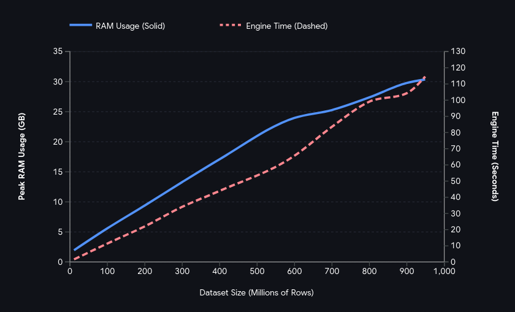
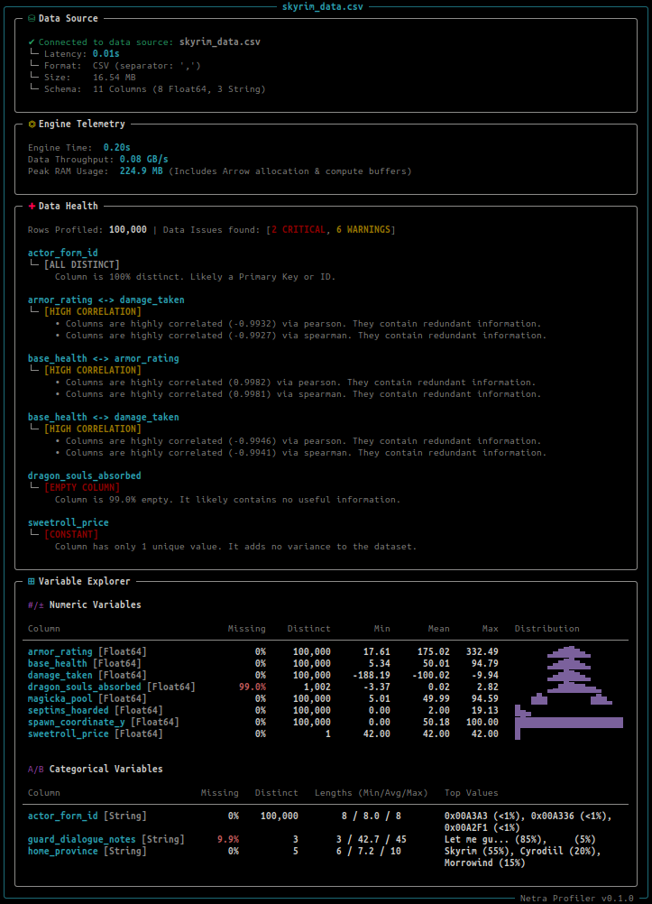

# Netra Profiler

### High-performance profiling and data quality tool built with Polars

Netra Profiler is a next-generation data profiling tool and diagnostic engine built on top of [Polars](https://github.com/pola-rs/polars). Designed to operate at the speed of your disk I/O, it leverages Polars' Rust-based query optimizer and zero-copy Apache Arrow memory model to maximize the profiling capabilities of your local hardware. Netra processes massive datasets with predictable, linear RAM usage, eliminating the sudden memory spikes and crashes associated with traditional Python tools.

The profiler ships with a comprehensive diagnostic engine to detect column-wise data quality issues early in your analysis or modeling workflows, such as high zeros/null count, high cardinality, data skew and more. The tool includes a detailed, zero-configuration CLI for quickly profiling your CSV, JSON, Arrow/IPC or Parquet files.

## Performance & The Data Envelope

Data Envelope is the maximum size and complexity of data your organization can process within your hardware limitations or cloud cost limits. Netra Profiler is designed to be a **value multiplier** for your existing hardware by expanding your data envelope to include larger data workloads, and optimize your current workflow with faster, more efficient processing, which means less time and costs spent running profiling tasks. 

### A. Single-Node Workstation

Tested locally on a consumer laptop machine with the following specifications:

* **CPU:** Intel(R) Core(TM) i7-10750H CPU @ 2.60GHz (12 Cores)
* **RAM:** 32 GB
* **OS:** Ubuntu 24.04.4 LTS
* **Storage:** 512GB NVMe SSD

Dataset Schema: **11 Columns** (3 Int, 4 String, 2 Float, 1 Bool, 1 Date), **12 Million Rows**. Details can be found in the generation script [here](benchmarks/forge_dataset.py).

File Size: 1.04 GB (CSV) / 225 MB (Parquet)

| Execution Mode | netra-profiler (Parquet) | ydata-profiling (Parquet) | netra-profiler (CSV) | ydata-profiling (CSV) |
| :--- | :--- | :--- | :--- | :--- |
| All stats, All columns | **3.20s**<br>(3.9 GB RAM) | 181.26s<br>(13.7 GB RAM) | **6.23s**<br>(7.1 GB RAM) | 222.05s<br>(11.5 GB RAM) |
| Ignore Primary Key | **2.78s**<br>(2.1 GB RAM) | 134.97s<br>(10.4 GB RAM) | **5.60s**<br>(6.4 GB RAM) | 161.74s<br>(8.6 GB RAM) |
| `low-memory`<sup>†</sup> / `minimal`<sup>‡</sup> | **1.41s**<br>(1.9 GB RAM) | 24.54s<br>(5.0 GB RAM) | **3.92s**<br>(5.4 GB RAM) | 33.25s<br>(3.9 GB RAM) |

<sup>†</sup> `low-memory` (netra-profiler): Replaces exact unique counts with an approximate method (HyperLogLog) and skips global sorts (skew, kurtosis and quantiles). Crucially, it **retains** the Pearson/Spearman correlation matrices by using a 100,000-row systematic sample.

<sup>‡</sup> `minimal` (ydata-profiling): Turns off the most expensive computations, and entirely **disables** the correlation matrices.

#### Performance Takeaways

* Netra Profiler is **35x to 56x faster** than traditional Pandas-based profiling out-of-the-box, and uses **up to 71% less memory**. Standard workloads that take minutes now finish in seconds.
* When dropping highly cardinal primary keys, the engine maintains a ~48x speed advantage while operating on just 2.1 GB of RAM (an 80% reduction vs Pandas).
* The `low-memory` mode maximizes your hardware's Data Envelope, allowing consumer hardware to handle large data workloads that otherwise require a scaled-up cloud node or distributed compute.

To determine the actual extent of the Data Envelope for the test hardware, we ran the profiler on an increasing row size of the benchmark dataset, in Parquet format:

| Rows | Engine Time | Peak RAM Usage |
| :--- | :--- | :--- |
| 12M | 1.41s | 1.9 GB |
| 100M | 11.08s | 5.5 GB |
| 300M | 33.76s | 13.2 GB |
| 500M | 57.38s | 20.9 GB |
| 700M | 83.16s | 25.2 GB | 
| 900M | 104.00s | 29.7 GB | 
| **950M** | **114.35s** | **30.3 GB** |

`netra-profiler` engine scales linearly and predictably thanks to the streaming-first architecture and the sampling strategy for calculating correlations, which keeps the memory footprint strictly proportional to the dataset size. This predictable scaling eliminates sudden Out-Of-Memory (OOM) crashes and allows you to accurately forecast your hardware limits. 



### B. Cloud Scale-Up (Vertical Scaling)

For multi-billion row datasets, deploying the profiler on a single heavy cloud instance bypasses the network-shuffle and orchestration bottlenecks of distributed systems, offering extreme performance without the cluster management overhead.

*(Benchmarks are in development)*

### C. Distributed Multi-Node (Horizontal Scaling)

Netra Profiler’s core engine is built purely on the Polars Lazy API, which means it is natively compatible with the Polars Distributed Layer out-of-the-box. Moving from a local 1-Billion row workload to a multi-node 100-Billion row cloud workload requires zero code rewrites.

*(Benchmarks are in development)*

## Features

- **Multi-Core Streaming Engine:** Built on Polars to completely bypass the Python GIL and utilize 100% of your CPU cores. By leveraging zero-copy Apache Arrow memory, Netra streams data directly from disk, eliminating the massive intermediate RAM spikes associated with traditional Pandas-based data processing.
- **Low-Memory Mode:** Process large datasets without crashing your machine. By passing the `--low-memory` flag, Netra intelligently switches to approximate counting and sampling techniques to keep RAM usage low.
- **Comprehensive Profiling:** Automatically extracts scalar statistics (min, max, mean, skew, kurtosis), streaming distributions (histograms), Top-K frequent values, and Pearson/Spearman correlation matrices.
- **Complex Type Support:** Automatically flattens nested Structs and computes length statistics for Lists and Arrays, allowing you to profile complex JSON or Parquet files with zero configuration.
- **Built-in Quality Alerts:** Stop bad data before it enters your pipeline. Netra's diagnostics engine automatically flags critical issues like zero-inflation, corrupted primary keys, extreme skewness, and high null percentages.
- **Beautiful Terminal UI:** Includes an information-dense, highly readable CLI dashboard to profile and check your data health directly in the terminal.
- **JSON Data Contracts:** Export the full diagnostic profile to a strictly typed JSON artifact (`netra profile data.parquet --json`) for CI/CD data quality gates, a metadata feed for data catalogs, or context for LLM-based data agents.
- **Python API:** Integrate seamlessly into your data engineering pipelines (Airflow DAGs, Marimo/Jupyter Notebooks, CI/CD) with a clean, expressive programmatic interface.

## Installation

Netra Profiler is built for speed. We recommend installing it with uv, the blazing-fast Python package installer:

```bash
uv pip install netra-profiler
```

(Or use standard `pip install netra-profiler`)

## Quickstart

### 1. The CLI

The fastest way to profile your data is right from the command line. `netra-profiler` natively supports .csv, .parquet, .json, and .arrow files.

```bash
netra profile path/to/your/dataset.csv
```



#### Advanced Execution Options
You can combine flags to handle massive or messy datasets with ease:

- `--low-memory`: Triggers the bounded-memory execution path (approximate counting and map-reduce sampling) to profile out-of-core datasets without crashing your RAM.
- `-i, --ignore <column>`: Skip profiling for a specific column (perfect for highly cardinal IDs, hashes, or PII).
- `--full-inference`: Forces full-file schema inference. Crucial for messy CSVs where data types might silently change deep in the file.
- `--json`: Disables the visual CLI output and generates the raw profile payload as a JSON string. Ideal for piping to `jq` or redirecting to a file: `> profile.json`.

### 2. The Python API

Netra Profiler exposes a fully typed Python API that accepts Polars DataFrames natively. The output is a rigidly typed Data Contract, making it perfect for programmatic quality gates.

```python
import polars as pl
from netra_profiler import Profiler

# 1. Load your data using Polars (Eager or Lazy)
df = pl.scan_parquet("sales_data.parquet")

# 2. Initialize the Profiler with the configuration
profiler = Profiler(
    df=df,
    dataset_name="Q3_Sales",
    ignore_columns=["transaction_id", "customer_hash"], # Drop highly cardinal IDs to save RAM 
)

# 3. Execute the profiling graph
profile = profiler.run(bins=20, top_k=10)

# 4. Access the strictly typed metrics
print(f"Total Rows Profiled: {profile['dataset']['row_count']:,}")

if "revenue" in profile["columns"]:
    mean_revenue = profile["columns"]["revenue"].get("mean")
    print(f"Revenue Mean: ${mean_revenue:.2f}")

# 5. Programmatic Data Quality Gates
# Alerts are categorized by severity (CRITICAL, WARNING, INFO)
alerts = profile.get("alerts", [])
critical_issues = [a for a in alerts if a["level"] == "CRITICAL"]

if critical_issues:
    print(f"\n[PIPELINE HALTED] Found {len(critical_issues)} critical data issues!")
    for issue in critical_issues:
        print(f" - [{issue['column_name']}] {issue['type']}: {issue['message']}")
    raise ValueError("Data quality checks failed. Upstream data contract violated.")
```

## License

This software is licensed under the [MIT License](LICENSE).
